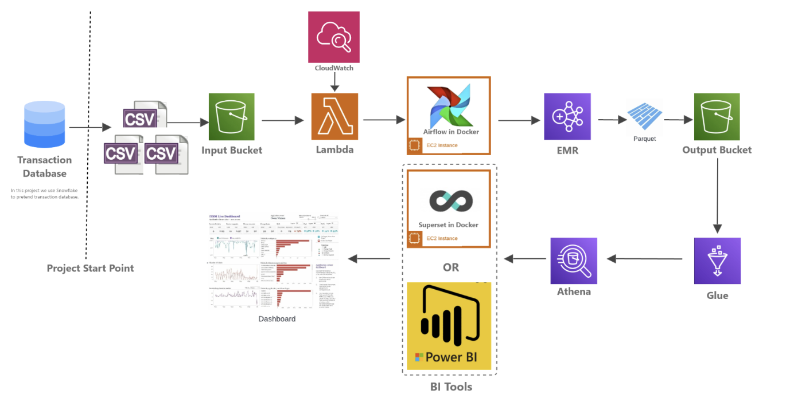

# wcd-midterm-batch-datapipeline

## Following files are included in this repository:

### Files used:
* lambda.py: main aws lambda function python code. This can be found [here](https://github.com/ShaheerKhan200/wcd-midterm-batch-datapipeline/blob/main/lambda.py).
* send_email.py: aws lambda function python code to send email upon failure. This can be found [here](https://github.com/ShaheerKhan200/wcd-midterm-batch-datapipeline/blob/main/send_email.py).
* transformation.py: aws lambda function python code to perform basic transformations. This can be found [here](https://github.com/ShaheerKhan200/wcd-midterm-batch-datapipeline/blob/main/transformation.py).
* Midterm_Transformation_Script.ipynb: pyspark transformation code to be used in EMR for data transformations. This can be found [here](https://github.com/ShaheerKhan200/wcd-midterm-batch-datapipeline/blob/main/Midterm_Transformation_Script.ipynb).
* midterm_dag.py: airflow dag file. This can be found [here](https://github.com/ShaheerKhan200/wcd-midterm-batch-datapipeline/blob/main/midterm_dag.py).
* 1.Data_Loading_Script_-_Arch_1.sql: snowflake sql file to set up data loading in snowflake. This can be found [here](https://github.com/ShaheerKhan200/wcd-midterm-batch-datapipeline/blob/main/1.Data_Loading_Script_-_Arch_1.sql).
* 2.Data_Integration.sql: snowflake sql file to set up data integration with AWS S3 in snowflake. This can be found [here](https://github.com/ShaheerKhan200/wcd-midterm-batch-datapipeline/blob/main/2.Data_Integration.sql).
* 3.stored_procedure_-_Automated_Data_Dump.sql: Stored Procedure using Python and SQL to automate data dumping to S3 from Snowflake. This can be found [here](https://github.com/ShaheerKhan200/wcd-midterm-batch-datapipeline/blob/main/3.stored_procedure_-_Automated_Data_Dump.sql).

### Result:
* Batch_Pipeline_-_Shaheer_WCD.pptx: Overview of the project. This can be found [here](https://github.com/ShaheerKhan200/wcd-midterm-batch-datapipeline/blob/main/Batch_Pipeline_-_Shaheer_WCD.pptx).

## Project
Here is the project architecture

## More details coming soon...
